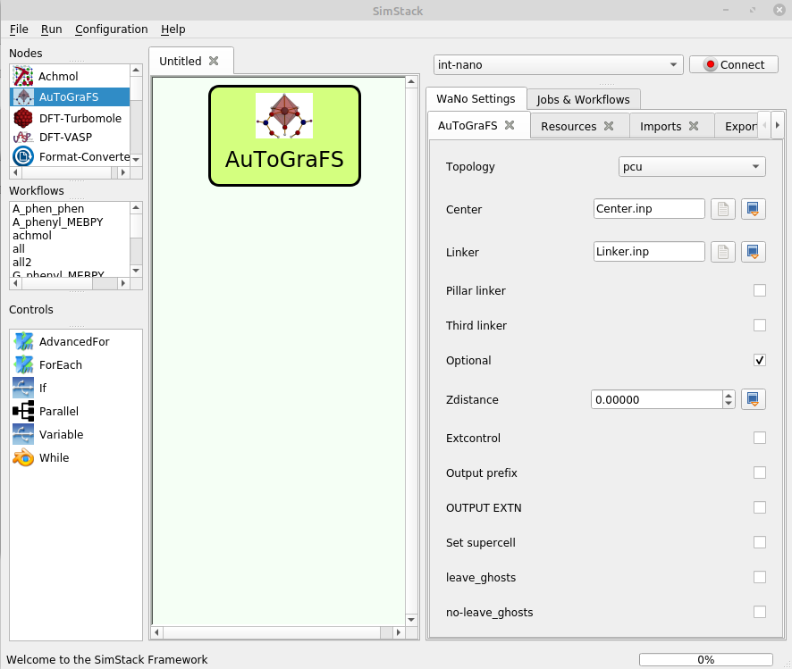

# AuToGraFS

This WaNo performs **AuToGraFS** to create initial MOF model. It creates the control.txt file for AuToGraFS and the MOF structure based on the linker and center (secondary building unit, SBU) files that are provided. The mofgen.py needs python2 with numpy library to run. The user must set the path for proper python2 on the server and the path for mofgen.py in AuToGraFs.xml file.

| Option | Explanation | Example | 
|------------------|--------------------|----------------------|
|Topology|acs,bcu,bnn,bor,cds,chs1_based_on_cgd,chs1,cpo27_cut2,cpo27_cut3,cpo27_old_notworking,cpo27,ctn,dia_B1,dia_B2,dia_c3,dia_c,dia,eta_c3,eta_c4,eta_c,fcu,flu,fsc,gar,gea,gez,hcb,hxg,iac,ibd,ifi,ins,kgm,lig_c,lvt,mab,mfu4,mil53,mtn_e,nbo,ntt_46,ntt,hosen="True">pcu,pth,pto,pts,ptt,pyr_c,pyr,qom,rho,rhr,rht,rob,rtl,she,soc,sod,spn,sqc11248,sqc12215,sqc1560,sqc19,sqc8845,sqc8955,sqc963,sql2,sql6,sql,sqp_B1,sqp_B2,sra_c,sra,srs_a_c,srs_c3,srs_c4,srs_c4s,srs_c8,srs_c,srs_cs,srs,stp,tbo,tcs,Td,the,ths_c,ths,twt_c3,twt_c,zmj|pcu|
|Center.inp|Select SBU (metal node) in inp format.|Center|Center.inp|
|Linker|Select the main (e.g. layer) linker in inp format. Use "Pillar linker" and "Third linker", when they are not identical to the main linker.|  Linker.inp|
|Pillar linker|  description ="Select the second (e.g. pillar) linker in inp format.|False|
|Plinker|Pillar linker file |Plinker.inp|
|Third linker|If three different linkers are used, select the third linker in inp format here.|False|
|Tlinker|Third linker file|Tlinker.inp|
|Optional|Optional features of AuToGraFS|False|
|Zdistance|Enter intitial Z distance for SQL MOF GULP optimization. Default: 25 Angstroems. Too small Z distance may generate wrong MOF structure.|0|
|Extcontrol|For the user-defined control.txt file|False|
|control.txt|control.txt|control.txt|
|database|Base path for centers, linkers and functional groups, Default: by default it uses the database that is created from user input.|database.tar.gz|
|Output prefix|Output file of the generated MOF (without postfix). Default=mof|False|
|OUTPUT EXTN|The AuToGraFS output format(extension). Default=.gin|False|
|Set supercell|Optional production of supercell. Default is None. Argument may be one integer or three.|False|
|leave_ghosts |  Leave extra ghost (Bq) atoms in structure for post functionalisation.|False|
|no-leave_ghosts|Leave extra ghost (Bq) atoms in structure for post functionalisation.|False|

