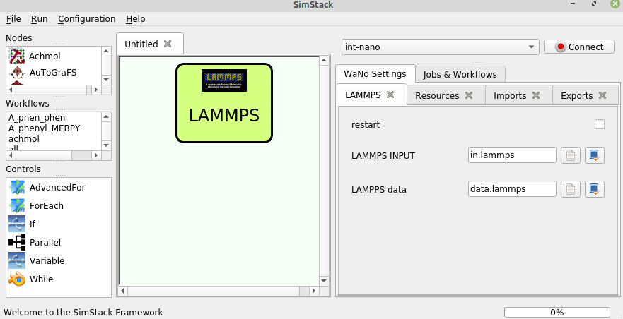

# LAMMPS

This WaNo accepts the input files necessary for running molecular dynamics (MD) simulations of MOFs using [LAMMPS](https://www.lammps.org/). It must be preceeded by *lammps-interface* WaNo, where all setup of MD run is specified.

To run MD for MOF structures generated in a **PCU-MOF** workflow, LAMMPS was compiled using `PKG_USER-MOFFF`.

