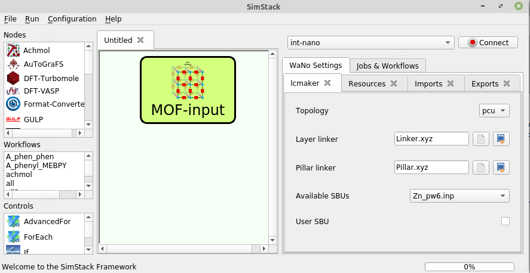

# MOF-input

This WaNo is a file provider (linker molecules, metal node type and desired topology) for the building a MOF model in a workflow. Here, the user uploads file  molecule files, e.g. in *xyz* format, and selects the SBU (metal center type) and topology. Information is passes to the next steps of the workflow. If the same workflow, i.e. the same setup in WaNos, should be used for a library of MOFs, input data are specified here with no further changes.

Layer linkers (with carboxyl groups) and pillar linkers (with N atoms that coordinate the SBU) are specified separately. This is important for the automated file preparation in *LCmaker* for [*AuToGraFS*](https://github.com/maddicoat/AuToGraFS). Some of widely used SBU (according to the are **AuToGraFS** database) implemented inside this WaNo and you can select them from the list. You can also select other types of SBU available in AuToGraFS, specifying the *inp* file location on your PC. 

  
