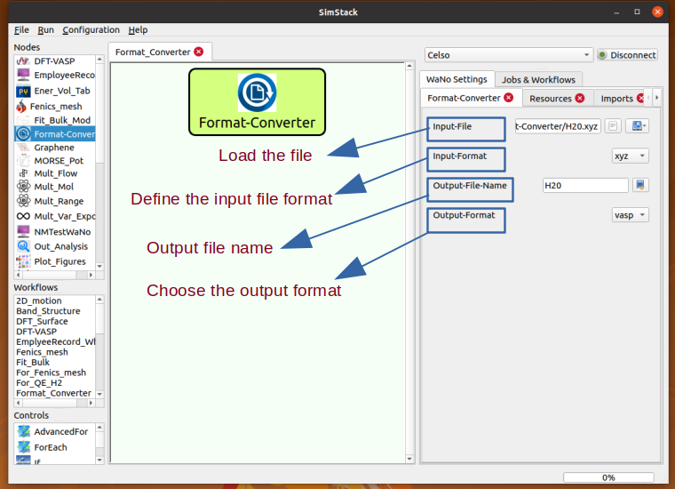

# Format-Converter

This WaNo uses `ASE` technology to convert a geometry file from `x` to `y` format. Very often, the `xyz` file does not contain information about the unit cell. However, this WaNo solves this problem by creating a cubic unit cell with a lattice parameter `25%` larger than the maximum distance between two atomic positions of the structure. In other words, it allows us to create a unit cell to file in `xyz` format.

**Fig 1** shows the description of the inputs and outputs fields. Currently, we support all possible combinations of the formats: `xyz`, `cif`, `pdb`, and `vasp`, which covers the geometric input files of the most widely used electronic structure codes.



**Fig 1** This WaNo converts geometric files format. In the figure, we describe the functionalities of the fields. All possible combinations between the `Input-Format` and `Output-Format` options are allowed.

## 1. Python Setup
To get this WaNo up running on your available computational resources, make sure to have the below libraries installed on Python 3.6 or newer.

```
1. Atomic Simulation Environment (ASE).
2. Numpy, os, sys, re, yaml. 
```

## 2. Running this Workflow

- Step 1. Move the Format-Converter folder to the WaNo directory. 
- Step 2. Open Simstack on your compute and connect to your remote resource.
- Step 3. Drag the WaNo from the top left menu to the SimStack canvas as shown in **Fig 1**.
- Step 4. A double click on the WaNo will allow you to make the setups in the Input parameters.
- Step 5. Name your WaNo with `Ctrl+S`, and running it with `Ctrl+R` command.

There are two `H20` geometry files in `vasp` and `xyz` formats. Following the above steps to play with them. 
